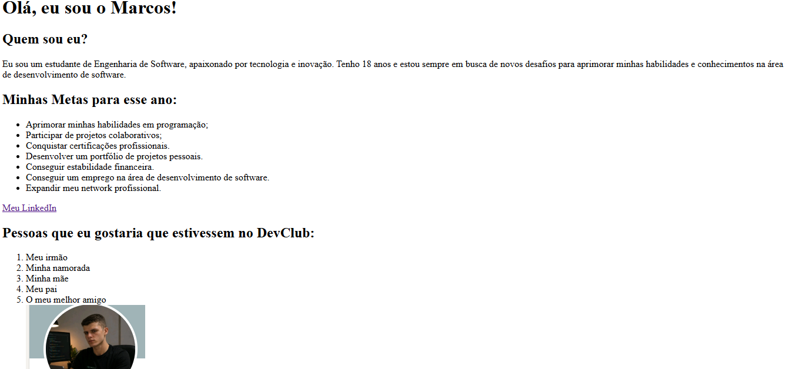

# 👋 Sobre Mim — Página de Apresentação Pessoal

 

Primeiro desafio do curso **Fullstack** da **DevClub**: uma página simples em HTML puro para apresentação pessoal, contando um pouco sobre quem sou, minhas metas e objetivos na área de tecnologia.

---

## 🔗 Repositório

GitHub: https://github.com/marcosdevnew/DESAFIO-1

---

## 📸 Preview do Projeto



---

## 🚀 Conteúdo da página

✅ Apresentação pessoal
✅ Lista de metas para o ano
✅ Link para o LinkedIn
✅ Lista de pessoas que eu gostaria de ver no DevClub

---

## 🛠️ Tecnologias Utilizadas

- HTML5

---

## 📂 Estrutura do Projeto

```
📦 DESAFIO-1
 ┣ 📂 img
 ┃ ┗ 📷 Captura de tela 2026-06-13 224649.png
 ┗ 📜 Desafio1.html
```

---

## ⚙️ Como Executar

Clone o repositório:

```
git clone https://github.com/marcosdevnew/DESAFIO-1.git
```

Entre na pasta:

```
cd DESAFIO-1
```

Abra o arquivo `Desafio1.html` no navegador.

---

## 🎯 Objetivo do Projeto

Primeiro contato com a estrutura básica do HTML, praticando:

- Tags semânticas (`h1`, `h2`, `p`, `ul`, `ol`, `a`, `img`)
- Organização de conteúdo em uma página simples
- Versionamento com Git e GitHub

---

## 👨‍💻 Autor

### Marcos Guilherme Carvalho de Oliveira

💻 Estudante de Engenharia de Software
🚀 Em busca da primeira oportunidade como desenvolvedor

GitHub: https://github.com/marcosdevnew
LinkedIn: https://www.linkedin.com/in/marcos-guilherme-794247267/

---

## ⭐ Apoie

Se gostou do projeto, deixe uma estrela no repositório.
